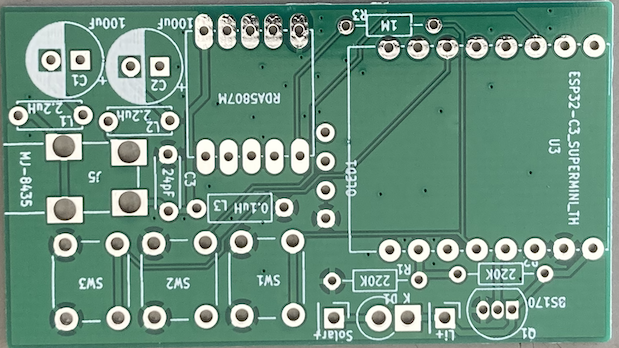
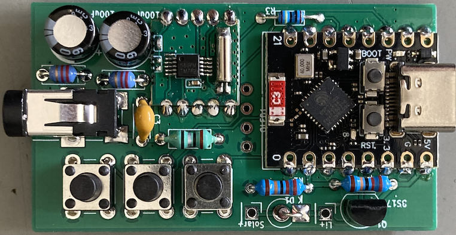
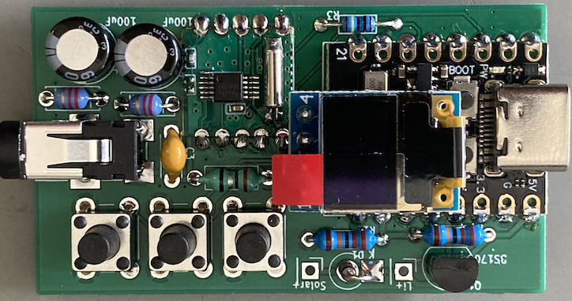
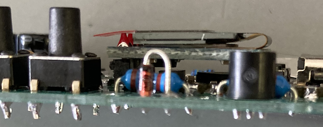
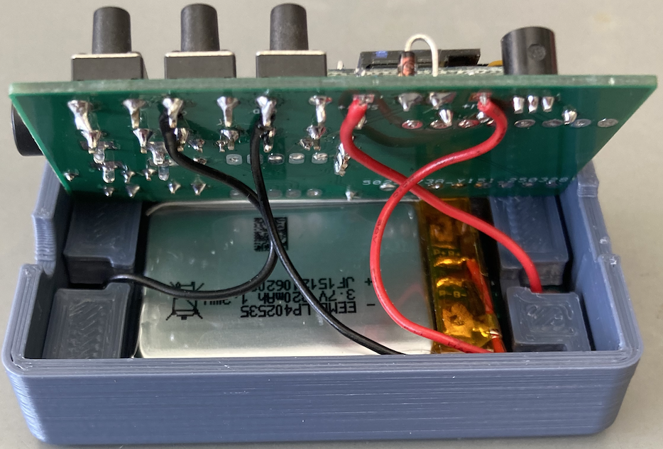
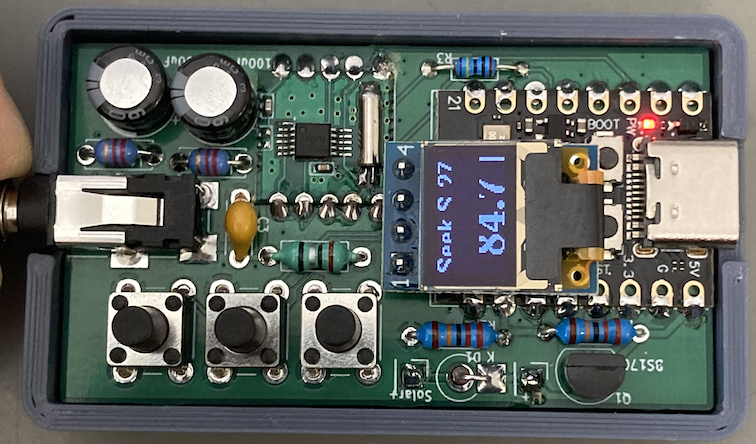
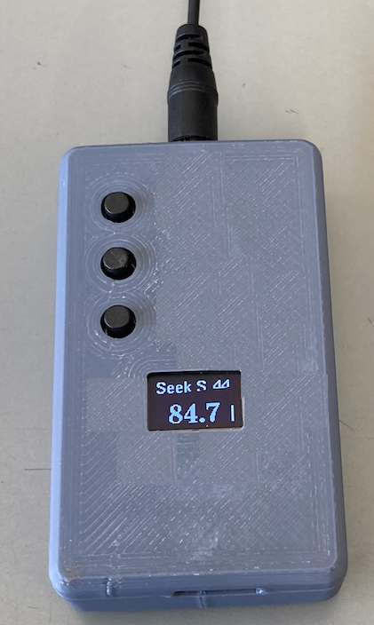
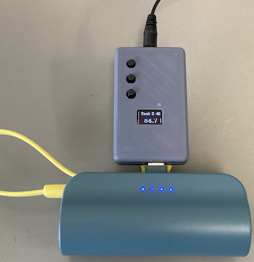

# Mini_Solar_FM_Radio(RDA5807m，ESP32C3supermini）

## コンパクトな太陽電池駆動FMラジオ
安価でコンパクトなFMラジオキットがAliexpressなどで売られています．  
最も安価なキットでは，５つのタクトスイッチで電源ON/OFF，選曲，音量を調整し，周波数表示などはありません．  
Blog（https://je1rav.blogspot.com/2025/03/fm.html
 ) では，これらのキットを使用した太陽電池駆動のコンパクトなFMラジオの製作を紹介しました．  
ここでは，周波数表示を追加した太陽電池駆動のコンパクトなFMラジオを製作します．  

主な機能は以下の通りです． 

### 1．FMラジオはRDA5807mモジュールを使用
	I2Cで制御できるRDA5807mモジュールが非常に安価に入手できます．  
	また，PU2CLRさんが”RDA5807 Arduino Library”を公開しており，Arduinoで簡単にプログラムが組めます．  

### 2．オーディオ出力はイヤフォンで，イヤフォンケーブルをアンテナとして使用
	安価なFMキットと同様にイヤフォンケーブルをFMアンテナとして使用します．  

### 3．電源は太陽電池+Liイオン電池
	Blogで使用した太陽電池モジュール53X30mm 5V出力を使用し，安全回路付きLiイオン電池モジュール(402535型)を使用します．  

### 4．コントローラーはESP32-C3 Super Miniボード + 0.42inch OLEDモジュール
	ESP32-C3は安価で，小型ボードが販売されており，かつ簡単にスリープ機能が利用できて電池駆動に向いていますので，これを使用することにします．
	多くの安価なボードは日本の技適は取得していないため，日本国内でWiFi, Bluetoothが使用出来ませんが，今回の目的には問題ありません．
	0.42inch OLED付きのESP32-C3 Super Miniボードも数種販売されていますが，Aliexpressで安価に手に入る16ピンの物はOLED表示が暗いのが難点です．
	15ピンのものはOLED表示は明るいのですが，少し高価なのと裏側のインターフェイス用コネクタの背が高くて邪魔です．
	という訳で，OLEDモジュールは別付けにしました．
	0.49inchは画素が少なく(64x32)，0.98inch(128x64)はサイズが大きいので，今回は0.42inch(72x40)にしました．

回路図は，
  
D1は太陽電池への逆流防止用シリコンダイオードです．  
太陽電池を使用しない場合には，D1は不要です．  
Liイオン電池モジュールは，安全回路で充電電圧が4.2V以上になると充電停止になります．  
シリコンダイオードの順方向電圧降下は0.8V程度なので，5V出力の太陽電池に接続するのは好都合です．  
  
Liイオン電池の出力はESP32-C3 Super Miniボードの5V入力に接続しています．  
電源電圧は抵抗(R1,R2)で1/2に分圧した後，ESP32C3のADCでモニターします．  
  
Liイオン電池や太陽電池を内蔵せずに，市販のモバイルバッテリーを使用する場合も考えました．  
市販のモバイルバッテリーの多くは，使用電流が低いまま一定時間を過ぎると自動で電流を切断します．  
今回のFMラジオも消費電流が20mA程度と小さく，そのままだと自動で電源遮断されます．  
モバイルバッテリーの自動電源OFF機能は，30秒以内に一度100mA程度の電流を流せば回避できるようです．  
という訳で，この対策のためにQ1のMOS-FET(BS170or2N7000)による放電回路をつけました．  
BS170(or2N7000)のデータシートによりますと，G-S間に3.3Vをかけた場合，DS電流は200mA程度になるようですので，これを利用して自動電源OFFを回避します．  
設定でAnti-APO(Auto Power Off)をONにすると，25秒おきに1秒間200mA程度(少し過大かもしれませんが)の電流が追加で流れます．  
ダイソーのUSB-C直結5000mAhモバイルバッテリー(TGC，税込1100円)ではうまく作動しましたが，この程度ではうまく回避できないモバイルバッテリーもあるようです．  
低電流モードを持っているモバイルバッテリーでしたら，Anti-APOをONにする必要はないかもしれません．  
内蔵Liイオン電池で使用する場合には，Q1は必要ありません．  
  
RDA5807のオーディオ出力はコンデンサーとインダクターを通してイヤフォンジャックにつながっています．  
RDA5807のアンテナ入力にはコンデンサーとインダクターの並列共振回路がついており，FM放送バンド以外の信号をGNDに逃しています．  
  
今回使用したFMラジオでは，ESP32-C3の"deep sleep"モード時にも約0.4mAの電流が消費されます．  
ESP32-C3 Super Miniボード上の電源LED(赤)を取り外せば0.1mA以下になりますので，内蔵バッテリーを使用する場合にはこのLEDの取り外しをお勧めします．  
R3は"deep sleep"からの復帰用(本当は勝手に復帰しないようにするため)のプルアップ抵抗です．　　
  
  プリント基板部品（厚み1mm）  

  部品をつけた状態  

  OLEDもつけた状態   

  横から見た状態(OLEDは少し浮かせてはんだ付け)    

  太陽電池とリチウムイオン電池との接続  

  ケースに入れた状態(電源LED(赤)は，まだ取り外していない)  

#### 製作時の注意点
	1．ESP32-C3 Super Miniボードは，基板から浮かないように，はんだ付けします．
	2．すべての部品は背が低くなるように取り付けて下さい(基板上6mm程度以下)．電解コンデンサーは5mm高のものを使用して下さい．
	3．0.42inchのOLEDモジュールは，基板から約1mm浮かせて最高高さが6mmになるようにしてはんだ付けします．
	4．タクトスイッチは7mm以上の高さのものを使用して下さい．
	5．内蔵バッテリーで使用する場合は，なるべくESP32-C3ボード上の電源LED(赤)を取り外して下さい．
	6．太陽電池およびリチウムイオン電池の負極側は基板のGNDに繋いでください．　　

#### ESP32-C3 Super Mini用スケッチは"RDA5807_ESP32C3_0.42OLED.ino"です．  
	PU2CLRさんの”RDA5807 Arduino Library”を使用しました．
	OLEDの表示には，"U8g2"を使用しました．
	ボードマネージャは，2.0.17を使用しました．
	この際，ボードとして"ESP32C3 Dev Board"を選んでください．

	OLEDに最も近いタクトボタン(Modeボタン)でモード切り替えを行い，残り２つのアップ/ダウンボタンで設定変更をします．
	1．シーク選局モード（高周波数側/低周波数側に局変）
	2．音量調節モード（音量アップ/ダウン 0-15）
	3．オーディオ出力のステレオーモノラル指定モード（ステレオONもしくはOFF）
	4．バッテリー電圧表示モード（アップ/ダウンボタンで再測定）
	5．モバイルバッテリーの自動電源OFF対策の指定モード（ONもしくはOFF）
	6．周波数でチューニングするモード（0.1MHzごとにアップ/ダウン）
	を順番に切り替えます．
	
	ボタン入力がないと1秒後にESP32C3は"light sleep"モードになって，消費電流を減らします．これは，ボタン入力で復帰します．
	また，25秒ごとにタイマーで復帰し，バッテリー電圧をチェックします．この時，モバイルバッテリーの自動電源OFF対策がONになっていると．約200mAの電流が1s間流れます．
	OLEDの右端の縦棒表示がバッテリー残量の目安を示しており，バッテリー電圧が3.1V程度以下になると，強制的に"deep sleep"モードになります．
	Modeボタンの長押し(2秒）でESP32C3は"deep sleep"モードなって，いわゆる電源OFF状態になります．
	電源OFF状態でModeボタンを押すと，リセットが掛かって電源ON状態になります(自動電源OFF付きモバイルバッテリー使用の場合は，モバイルバッテリーの再電源ONもしくは抜き挿しが必要です)．
	このリセットが掛かる時，Modeボタンを長押しておくと，EEPROMの内容がリセットされます．
	
#### JLCPCB用のガーバーファイルは"RDA5807m_ESP32C3-garbar.zip"で基板厚み1 mmて作製しました．Kicadのファイルは"RDA5807m_ESP32C3-kicad.zip"です．  

#### ケースの3Dプリント用ファイル(.stl)は"RDA5807m_ESP32C3_0.42OLED-case.zip"です．  
	Liイオン電池のスペーサー以外のケースのファイルは102％程度に拡大して印刷して下さい．
	Liイオン電池のスペーサーファイルは100％で印刷して下さい．
  太陽電池＋内蔵リチウムイオン電池での運用例  
  
#### Liイオン電池や太陽電池を含まず，モバイルバッテリーに繋いで使う時のケースの3Dプリント用ファイル(.stl)は"wo_battery-case.zip"です．  
	ファイルは102％程度に拡大して印刷して下さい．
  ダイソーのモバイルバッテリーでの運用例(Anti APOは，ON)  
  
#### 消費電流（目安，ESP32-C3 Super Miniボード上の電源LED(赤)を取外し済み，残している場合は+0.34mA）
	FM放送受信時(Vol最小，OLED周波数表示，定常時(CPUはlight sleep))： 22mA
	電源OFF状態(deep sleep)： 0.07mA

#### 注意事項
	Liイオン電池内蔵型はPC等にUSB接続すると，Liイオン電池が充電されます．保護回路が入っているLiイオン電池を使用しているとは思いますが，過充電に注意して下さい．

#### 必要部品(2025年3月27日現在)  
	DRA5807mモジュール：たとえば秋月電子 360円　https://akizukidenshi.com/catalog/g/g117315/，アマゾンやAliExpressでも購入可
	ESP32-C3 Super Mini：アマゾンやAliExpressなどで購入
 	0.42inch OLED module：アマゾンやAliExpressなどで購入
	BS170あるいは2N7000：モバイルバッテリー直結使用の場合，たとえば秋月電子 30円　https://akizukidenshi.com/catalog/g/g109724/
	太陽電池モジュール53mmx30mm：アマゾンやAliExpressなどで購入
	Liイオン電池（保護回路付き）402535：アマゾンなどで購入
	タクトスイッチ：3個　例えば秋月電子(長さ9.5mmで少し長過ぎる)，15円https://akizukidenshi.com/catalog/g/gP-17166/
	汎用シリコンダイオード：例えば1N4148，秋月電子50本　150円　https://akizukidenshi.com/catalog/g/g100941/
	電解コンデンサ100μF(高さ5mmのミニサイズ）：2個  
	セラミックコンデンサー24pF程度： 1個
	インダクター0.1uH： 1個（アキシャル型LGA0307）：たとえばサトー電気 5個55円
	インダクター2.2uH： 2個（アキシャル型LGA0204）：たとえばサトー電気 5個50円
	抵抗　220kΩ：2個  
	抵抗　1MΩ：1個  
